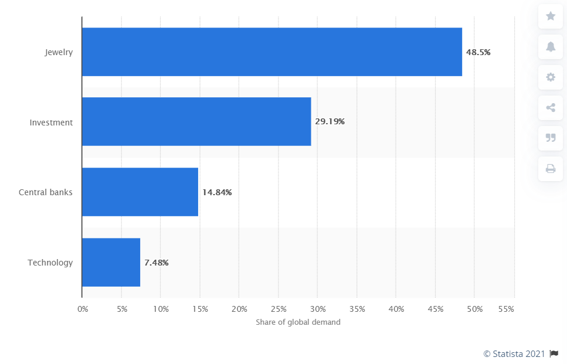

# The bull case for Ethereum part 2: Money, inflation and asset monetization

* Contrary to traditional economic theory, [money](https://en.wikipedia.org/wiki/Fiat_money) does have [intrinsic value](https://www.ig.com/en/glossary-trading-terms/intrinsic-value-definition). It can be derived from the [functions of money](https://www.investopedia.com/terms/m/money.asp). Money’s main intrinsic value can be described as the facilitation of economic activity and preservation of wealth.
* The need for alternative monetary/reserve assets such as gold arises from the inflationary nature of fiat money, which makes it a poor asset in respect to wealth preservation.
* Money’s importance as an economic activity facilitator is reflected in the global money supply which is almost 10 times higher than gold’s market cap, even though gold is more scarce and a superior preserver of wealth.
* [The value of currencies is highly correlated with the level of economic activity that it is facilitating](https://www.investopedia.com/ask/answers/070615/what-correlation-between-money-supply-and-gdp.asp). This reinforces the idea that economic facilitation, not scarcity, is the most important attribute of money. It also explains why the [petrodollar](https://www.investopedia.com/terms/p/petrodollars.asp) was so critical to USA’s monetary policy after Nixon backed out from the [Bretton Woods Agreement](https://www.investopedia.com/terms/b/brettonwoodsagreement.asp).
* The term [reserve asset](https://www.investopedia.com/terms/r/reserve-assets.asp) is not a binary attribute. Any asset has the potential to become partially monetized. Asset monetization can be defined as a _sustained_ premium over its intrinsic value (ie: [asset inflation](https://en.wikipedia.org/wiki/Asset_price_inflation)) which results in a lasting impact reflected on its market valuation psychology. Reserve assets are just highly monetized assets.
* Ideally, currencies should have no intrinsic value other than to serve as money - it should be completely useless (fully monetized). The fact that fiat money is useless is a strength point, not a weakness. Gold is not fully monetized because it has industrial intrinsic value, which actually diminishes its value as a reserve asset. This directly contradicts narratives from Warren Buffet and Peter Schiff.
* Bitcoin was originally designed to be an electronic cash system. Its narrative shifted to “digital gold” when it became evident that Bitcoin would not be able scale its payment rail. Digital gold may sound like a wonderful thing, but it is an admittance of Bitcoin’s flaws at attempting to become a frictionless digital monetary asset.
* What is often described as Ethereum’s “utility” is actually referring to the economic activity that takes place within the network and is primarily facilitated by ether. This economic activity is a very important contributor to the value of ether.
* **_Ethereum reduces the friction of economic activity that requires trust and/or permission while hosting a fully programmable money, the ability to create infinite variety of digital assets and achieving a sustainable net zero issuance monetary policy._ These properties make ether the world’s preeminent monetary asset by a large margin. There is NOTHING else in the world that can be compared to ether and the network effect of Ethereum. The rise of ether will generate an enormous amount of disruption to all pre-existing forms of reserve and monetary assets - it effectively makes them obsolete. It will suck out the monetary premium from gold, bonds, equities, real estate and eventually Bitcoin**

## Monetary and Reserve Assets

The topic of money is central to cryptocurrencies. The definition of money has been discussed, analyzed and dissected ad-nauseam by almost every major crypto influencer in this space. Andrea Antonopolous has done a wonderful good job covering this subject from historical, economical and political perspectives. However, I was left with a feeling that there was something big missing, but I just could not explain what it was. There are a couple of narratives surrounding money and Bitcoin that don’t add up, and conventional economic theory doesn’t fully explain the nature of money. This is what was bothering me the most:

1. Bitcoin’s narrative suggests that scarcity is the most valuable property of monetary assets because it is what defines it as “hard money”.
2. Warren Buffet’s accusation that Bitcoin is worthless because it has no intrinsic value, and it is not a productive asset.
3. The fact that global money supply is worth about 10 times gold’s market capitalization despite the latter being more scarce.
4. The lack of consensus explaining why multiple asset classes are so overvalued and disconnected from fundamentals. The lack of consensus determining the sustainability of this situation and how it can be eventually resolved.

I believe I have found an explanation that debunks these narratives while also providing an answer to why fiat money is more valuable than gold. It starts with analysing the meaningfulness of the functions of money. The most concise break down of the functions of money splits it into three categories:

1. Store of Value
2. Medium of Exchange
3. Unit of Account

If you are not familiar with these, you can read more about it [here](https://www.investopedia.com/terms/m/money.asp). Traditional economic theory states that money does not have intrinsic value. Many people intuitively disagree with this premise, but there is no official rebuttal to it. We can attempt to derive the intrinsic value of money by analysing its core functions.

Money’s functionality as a medium of exchange and unit of account can be condensed into a single function: economic activity facilitator. It is the combination of money’s properties as a medium of exchange and as a unit of account that defines its utility as a facilitator of activities that generate economic output. Another way to say this is that money reduces the friction that is caused by the need to communicate and exchange value during economic activity. The easiest way to demonstrate this is by conceptualizing what would happen to a country’s economic output if it stopped using money overnight. It would become total chaos, and productivity would be dramatically reduced. If you agree that an economy facilitated by money works more efficiently than a barter economy, then you’ll agree that one of the core functions of money is to facilitate economic activity. Consider the revised list of functions of money:

1. Store of Value
2. Economic Activity Facilitator
    1. Medium of Exchange
    2. Unit of Account

This is starting to look better, but there is one more thing that needs to be re-evaluated. Store of value is not a monolithic function. It needs to be contextualized by time, and doing so generates polar ends representing short-term store of value and long-term store of value. These are not core functions of money, they are actually subsets of something else. Long-term store of value is a subset of its function as a preserver of wealth, while short-term store of value is a subset of the previously defined economic activity facilitator. These needed to be differentiated because businesses and people are not primarily dealing with money as an investment, but rather as an expendable resource that is in constant rotation through cash flow. The motivation to operate with cash is to prevent a sudden short-term loss, and fiat money is much more effective at this. I would also argue that, as a psychological motivator, the fear of a significant short-term loss is stronger than the certainty of a gradual long-term loss. However, there is a threshold to the amount of short-term loss that is acceptable… it is hard to quantify an exact number, but when a currency crosses this, it means that it is collapsing.

<TODO: expand on explanations of how money reduces friction as a language to express value, how it facilitates commerce and give concrete examples of how it improves productivity>

<TODO: demonstrate the value of money as a wealth preserver by contrasting it with the best alternative that is not money, include upkeep costs and possible decay>

With that in mind, here is the updated list of functions on money:

1. Preserver of wealth
    1. Long-term store of value
2. Economic activity facilitator
    2. Medium of Exchange
    3. Unit of Account
    4. Short-term store of value

Another way to look at this list would be to say that the two newly defined core functions are actually the intrinsic value of money. In a subtle way, these things are what is produced by the utilization of money. Ultimately, these are the two reasons money has intrinsic value ordered by level of importance:

1. Facilitation of economic activity
2. Preservation of wealth

We don’t need to know exactly how the intrinsic value is calculated, we just need to know that it is real. With this understanding of money, it becomes easier to continue to explore answers for unexplained observations and debunk other misconceptions. Let’s start with what is conventionally understood as gold’s intrinsic value: its industrial use. The intrinsic value of gold as an industrial resource has nothing to do with its intrinsic value as a monetary asset. These have completely different uses with different demand curves competing for the same resource. This is not a good thing because a demand shock of its industrial use would result in a supply shock of its monetary use. This can be easily observed with a real case scenario of another resource that is partially monetized, but that holds a much higher level of non-monetary utility: black gold, aka oil. In 2020 the demand shock for oil as fuel resulted in a supply shock of oil as a monetized commodity, and the price inevitably collapsed. Oil has a relatively low monetization premium, but I used it as an example to demonstrate how alternative intrinsic values are not desirable for reserve/monetary assets.

The more “real world” value a monetary asset has, the more it is susceptible to be affected by its alternative demand. The only positive thing that can be said about alternative demand is that it would prevent the value of a monetary asset from going to zero. Gold is not a good store of value because it has a conventional intrinsic value. It is a good store of value despite of it. The perfect monetary asset should be completely useless and devoid of any real world use other than to function as money.  Warren Buffet’s argument that bitcoin is worthless because it has no intrinsic value is actually the reason it is a superior form of money (even better than paper money) - it combines some of the best properties of gold and fiat.

Fiat is vastly superior as an economic activity facilitator than gold, and the fact that it has no alternative intrinsic value strengthens its function as a short-term SoV. Money’s utility as an economic facilitator is much more valuable than its utility as a preserver of wealth. This is the reason why global money supply is worth about 10 times more than gold. Bitcoin’s theory that it is so valuable simply because it is a hard asset is flawed. If L2 solutions, EIP-1559 and Ethereum 2.0 are executed properly, then ether will be even harder than bitcoin, and it will have the advantage of hosting its own virtual economy with a dramatically superior payment rail. These are not just nice things, these are requirements for frictionless money.

## Inflation

When money supply increases faster than economic activity, then one of two things must happen: money velocity will fall, the value of money will fall (ie: inflation). The result is heavily dependent on consumer sentiment and distribution of wealth. If consumer sentiment is low, then people are naturally encouraged to save more money. If the newly printed money is allocated to the affluent, their spending habits will barely change. Money is a very effective economic activity facilitator, but its inflationary nature makes it a bad asset to preserve wealth. When money supply exceeds the demand for economic activity, then there is an incentive for it to be re-invested into different assets that have superior properties pertaining to wealth preservation. This increases the monetization of gold, and other contenders that share characteristics desirable for long term store of wealth. An increase in money supply that fails to increase consumer confidence and/or is not efficiently allocated generates inflation of other asset classes as they become increasingly monetized.

The conclusion is that inflation can be manifested in two ways:

1. [Official inflation](https://www.investopedia.com/terms/i/inflation.asp): focused on the rising price of goods and services.
2. [Asset inflation:](https://en.wikipedia.org/wiki/Asset_price_inflation) manifested through the monetization of alternative asset classes (this is what is happening today in global markets). This type of inflation is not reflected on official numbers.

When you hear that the US dollar is not seeing any inflation, you must know that asset prices are completely disregarded, but this is where most of the newly printed money is ending up.  This helps to explain why the equity markets are completely disconnected from fundamentals, why bonds have near-zero or negative yields, and why real estate prices keep going up even though unemployment and economic uncertainty continue to creep up. The market’s sentiment towards mega corporations, and their story, has become more optimistic than gold despite record high valuations. The likelihood these companies will issue new stock is virtually non-existent. Apple, Google, Microsoft, Facebook and others are effectively competing with gold. This will change as the market learns about and gains confidence in Bitcoin and Ethereum. Why? Because bitcoin and ether were designed to be monetary assets that excel at performing as economic activity facilitators and preservers of wealth.

The problem with Bitcoin is that it is aspiring to become a currency without its own economy. It is traded as a speculative asset without much utility built around it and without a clear vision of how it will evolve into a mature currency other than through continued speculation backed by the narrative that it is better than gold. It is becoming more evident that ether is better suited as frictionless money because it is shaping up to be a better asset in terms of facilitating economic activity and preserving wealth. These two values are supported by the protocol’s ability to issue and operate with an infinite amount of digital assets, and a crypto-economic model that allows for a sustainable zero issuance monetary policy (potentially becoming a deflationary asset).

Bitcoin is gripping to the idea that a fixed monetary policy is unconditionally better than a variable one, that no leadership is better than effective leadership, and that it is a finished product. Ethereum, on the other hand, is being propelled by a razor sharp and effective leadership that is centered around a strong ideology, but also seeking pragmatic solutions to keep things moving forward. The community recognizes the weaknesses of cryptos, and they are tackling issues one by one.

Gold has been a finished product for over 2,600 years… how is this argument holding out lately?

When Bitcoin maximalists started to recognize the protocol’s limitations, they shifted the narrative from “electronic cash” to “digital gold and/or reserve asset”. There is another big problem with this narrative. The need for an alternative reserve asset emerged from fiat money’s deficiency as a wealth preserver. If fiat money were perfect, there would be no need for gold. Ideally, money should be frictionless, non-inflationary and backed by its own economy. If it accomplishes all of these things well enough, then there would not need for an alternative reserve asset.The very idea of a reserve asset becomes obsolete in the presence of a pristine monetary asset. &lt;TODO: this needs work> Ethereum gave birth to a virtual economy and ether is the strongest candidate for the role as the world’s most pristine monet asset. Ether is redefining the very concept of money, but for now it is still just a snowflake on the tip of an iceberg.

---

<TODO: need to create better explanations and examples for asset monetization, reserve assets, and how/why the idea of a monetary premium is important>

Asset monetization can be calculated as a ratio

Any asset can be monetized, when the price of an asset is sustained above its intrinsic value, then it becomes monetized. The monetary premium of an asset can be defined using two metrics:

Monetary premium = market price - intrinsic value (fair valuation)

Monetary premium ratio = monetized premium / market price

Example of gold monetization premium. This is a simplistic formula to be used as an example and it is not an accurate representation of the real monetary premium. I am classifying jewelry consumption as being part of the monetary premium because its commercial attractiveness is largely driven by the fact that gold is a highly monetized asset and it is a symbol of status:

Gold’s monetary premium ratio: 92%

## The economic backdrop

* Poor distribution of wealth, an accelerated expansion of monetary base and a sharp decline in consumer confidence has contributed to the monetization of alternate asset classes such as equities and real estate.
* Mega corporations like Apple, Microsoft and Google have increasingly become monetized because they are potentially perceived as a better alternative to gold. The likelihood these companies will vanish or issue new stock is virtually non-existent. In this regard, they are viewed favorably in contrast to gold, which has an annual mining output of around 2% of its total supply.
* [The average lifespan of a FIAT currency is only 27 years](https://monetarygold.com/global-reserve-fiat-currencies/#:~:text=Fiat%20currencies%20have%20an%20average,a%20fiat%20global%20reserve%20currency). Monetary collapses are critical catalysts that will allow for cryptos to gain mass adoption and evolve into mature currencies. Crypto is the better choice anytime inflation becomes worse than volatility. People will soon start rejecting new versions of the old same thing… As monetary policies fail, Bitcoin and Ethereum will benefit from an increase in adoption. It is monetary natural selection at work, and it has never been more relevant.
* Government backed fiat money really means that the administrative partnership between federal governments and central banks should be successful at implementing fiscal and monetary policies, allocating capital, managing cash flow and persuading and/or enforcing the use of fiat as a facilitator of economic activity. The dollar is failing miserably at all of the above.
* Europe’s monetary system is also under extreme distress. The IMF is already setting the stage for drastic changes on a global scale by announcing that it is time for a [Bretton Woods 2.0](https://www.imf.org/en/News/Articles/2020/10/15/sp101520-a-new-bretton-woods-moment). The significance of this announcement cannot be understated.
* Unlike the original [Bretton Woods Agreement](https://www.investopedia.com/terms/b/brettonwoodsagreement.asp), today the global monetary systems are operating without any safety net. World currencies are backed by the American dollar, but the dollar is backed by nothing - even the petrodollar is falling apart. The global monetary system is walking on a tightrope without any kind of safety net.
* $18 trillion in negative yielding debt has been accumulated globally. This is the single strongest indicator that markets are broken and that capital is having a very hard time finding a place to be efficiently allocated. Excessive monetary expansion and poor distribution of wealth have created an “everything bubble” and crypto is well positioned to pop it.
* Politicians and central banks have been kicking the can down the road for so long that it has now become a steel barrel, and soon enough no amount of kicking will be able to make it budge.

## Ethereum’s economy

<TODO: there are sections here that have been poorly written, and it needs a lot of work, but the ground work is done>

People who do not understand the value of Bitcoin and Ethereum are focusing almost exclusively on who is using it, and what it is being used for. Scammers, criminals, terrorists and degenerate gamblers looking for a quick way to make money, engage in illegal transactions or finance nefarious activities - all of which will someday be stopped by governments or collapse from its own weight. To some degree, this is all true, but they are missing the big picture: Bitcoin and Ethereum are working very effectively as platforms that have legitimate use-cases, and they are vastly superior to traditional monetary and financial systems.

The “Silk Road” had an important role in building up Bitcoin’s value and proving that it could be effectively used as a permissionless, censorship resistant medium of exchange. People who were saying that Bitcoin was useless because the activity on the network was driven by criminals buying drugs missed the bigger picture: it worked as an effective form of money and payment rail that could also be used for legitimate reasons. Extend this logic to how Ethereum can be used to operate as a settlement network for an endless diversity of tokenized real world assets, such as the fiat money, gold, stocks, real estate, etc. It achieves this on a global scale with a significantly higher efficiency, speed and security than any other system. It can serve as a cheap and fast alternative in the remittances market. The ICO craze has proved that the Ethereum network can serve as a global platform to raise capital for startups. The DeFi wave is proving that it can be used for more sophisticated financial mechanisms and can operate as a global collateralized credit market. All of this while maintaining the same awesome properties that make Bitcoin narrative so compelling: inclusiveness, permissionless, censorship-proof, trustless. The developers who are exploring these new possibilities are breaking through uncharted territory. This is the wild west in an alien world, and things are going to be a little crazy on the frontlines. It would be entirely unreasonable to expect that “real world” companies would be the ones pushing ahead… it would be too risky, but where there is high risk, there is the potential for high reward. The so-called scammers and degenerate gamblers are paving the way and uncovering the solid ground where the rest of the world will be able to build the foundation of a new economy.

The digital world is becoming more important than the physical world. This is already true for younger generations, and there is no reason to believe this trend will slow down. The virtual space is a world of ideas, art and self-expression. It is borderless, boundless and not constrained by physical limitations of the real world. It is the only place where perpetual economic growth can be sustained without destroying our precious planet. If we are aspiring to build a virtual economy, then we are going to need a lot more than just digital gold. We need a virtual space where anyone can create value, and where value can be expressed and transacted in any form. If you are an Etherean, then you know I am talking about tokens, NFTs and smart contracts. If you think the future of the world is becoming digitized, and that virtual reality will be perhaps one day even more important than physical reality, then you might want to consider the idea Ethereum is shaping up to be the bedrock of the metaverse.

To be continued...

Sources:

What is intrinsic value?

[https://www.ig.com/en/glossary-trading-terms/intrinsic-value-definition](https://www.ig.com/en/glossary-trading-terms/intrinsic-value-definition)

Fiat money intrinsic value:

[https://en.wikipedia.org/wiki/Fiat_money](https://en.wikipedia.org/wiki/Fiat_money)

Money:

[https://www.investopedia.com/terms/m/money.asp](https://www.investopedia.com/terms/m/money.asp)

Monetary Asset:

[https://corporatefinanceinstitute.com/resources/knowledge/finance/monetary-assets/](https://corporatefinanceinstitute.com/resources/knowledge/finance/monetary-assets/)

Reserve Asset:

[https://www.investopedia.com/terms/r/reserve-assets.asp](https://www.investopedia.com/terms/r/reserve-assets.asp)

What Is the Intrinsic Value of a Stock?

[https://www.investopedia.com/articles/basics/12/intrinsic-value.asp](https://www.investopedia.com/articles/basics/12/intrinsic-value.asp)

Asset price inflation:

[https://en.wikipedia.org/wiki/Asset_price_inflation](https://en.wikipedia.org/wiki/Asset_price_inflation)

Inflation index controversy:

[https://www.investopedia.com/articles/07/consumerpriceindex.asp](https://www.investopedia.com/articles/07/consumerpriceindex.asp)

Money supply and GDP correlation.

[https://www.investopedia.com/ask/answers/070615/what-correlation-between-money-supply-and-gdp.asp](https://www.investopedia.com/ask/answers/070615/what-correlation-between-money-supply-and-gdp.asp)

Money Supply Influencing on Economic Growth-wide Phenomena of AEC Open Region:

[https://www.sciencedirect.com/science/article/pii/S2212567115006267](https://www.sciencedirect.com/science/article/pii/S2212567115006267)

Historical money supply to GDP ratios:

[https://data.worldbank.org/indicator/FM.LBL.BMNY.GD.ZS](https://data.worldbank.org/indicator/FM.LBL.BMNY.GD.ZS)

Consumer sentiment:

[https://www.investopedia.com/terms/c/consumer-sentiment.asp](https://www.investopedia.com/terms/c/consumer-sentiment.asp)

Historical Buffett Indicator:

[http://www.currentmarketvaluation.com/models/buffett-indicator.php](http://www.currentmarketvaluation.com/models/buffett-indicator.php)

The history of gold as money:

[http://www.silvermonthly.com/the-history-of-gold-as-money/](http://www.silvermonthly.com/the-history-of-gold-as-money/)

Demand for gold worldwide by sector in 2019:

[https://www.statista.com/statistics/299603/gold-demand-by-sector/](https://www.statista.com/statistics/299603/gold-demand-by-sector/)

All of the World’s Money and Markets in One Visualization:

[https://www.visualcapitalist.com/all-of-the-worlds-money-and-markets-in-one-visualization-2020/](https://www.visualcapitalist.com/all-of-the-worlds-money-and-markets-in-one-visualization-2020/)

Bitcoin white paper:

[https://bitcoin.org/bitcoin.pdf](https://bitcoin.org/bitcoin.pdf)

Average life of fiat:

[https://monetarygold.com/global-reserve-fiat-currencies/#:~:text=Fiat%20currencies%20have%20an%20average,a%20fiat%20global%20reserve%20currency](https://monetarygold.com/global-reserve-fiat-currencies/#:~:text=Fiat%20currencies%20have%20an%20average,a%20fiat%20global%20reserve%20currency).

Bretton Woods Agreement:

[https://www.investopedia.com/terms/b/brettonwoodsagreement.asp](https://www.investopedia.com/terms/b/brettonwoodsagreement.asp)

IMF’s Bretton Woods 2.0:

[https://www.imf.org/en/News/Articles/2020/10/15/sp101520-a-new-bretton-woods-moment](https://www.imf.org/en/News/Articles/2020/10/15/sp101520-a-new-bretton-woods-moment)

The importance of Petrodollar:

[https://www.investopedia.com/terms/p/petrodollars.asp](https://www.investopedia.com/terms/p/petrodollars.asp)

Russia’s bid to ditch the US dollar is slowly working, but obstacles remain:

[https://www.cnbc.com/2019/09/27/russias-bid-to-ditch-the-us-dollar-is-slowly-working-but-obstacles-remain.html](https://www.cnbc.com/2019/09/27/russias-bid-to-ditch-the-us-dollar-is-slowly-working-but-obstacles-remain.html)

A ‘growing club’ of ‘very powerful countries’ is steering away from using the dollar:

[https://www.cnbc.com/2019/10/31/de-dollarization-russia-china-eu-are-motivated-to-shift-from-using-usd.html](https://www.cnbc.com/2019/10/31/de-dollarization-russia-china-eu-are-motivated-to-shift-from-using-usd.html)

Russia Ditches the Dollar for Bulk of Its Exports to China:

[https://www.bloombergquint.com/global-economics/russia-ditches-the-dollar-for-bulk-of-its-exports-to-china](https://www.bloombergquint.com/global-economics/russia-ditches-the-dollar-for-bulk-of-its-exports-to-china)

Exclusive: Saudi Arabia threatens to ditch dollar oil trades to stop 'NOPEC':

[https://www.reuters.com/article/us-saudi-usa-oil-exclusive/exclusive-saudi-arabia-threatens-to-ditch-dollar-oil-trades-to-stop-nopec-sources-idUSKCN1RH008](https://www.reuters.com/article/us-saudi-usa-oil-exclusive/exclusive-saudi-arabia-threatens-to-ditch-dollar-oil-trades-to-stop-nopec-sources-idUSKCN1RH008)

$18 trillion in negative yielding debt has been accumulated:

[https://www.swfinstitute.org/news/83125/bloombergs-index-tracks-record-18-trillion-in-negative-yielding-debt-massive-growth-since-2014](https://www.swfinstitute.org/news/83125/bloombergs-index-tracks-record-18-trillion-in-negative-yielding-debt-massive-growth-since-2014)
